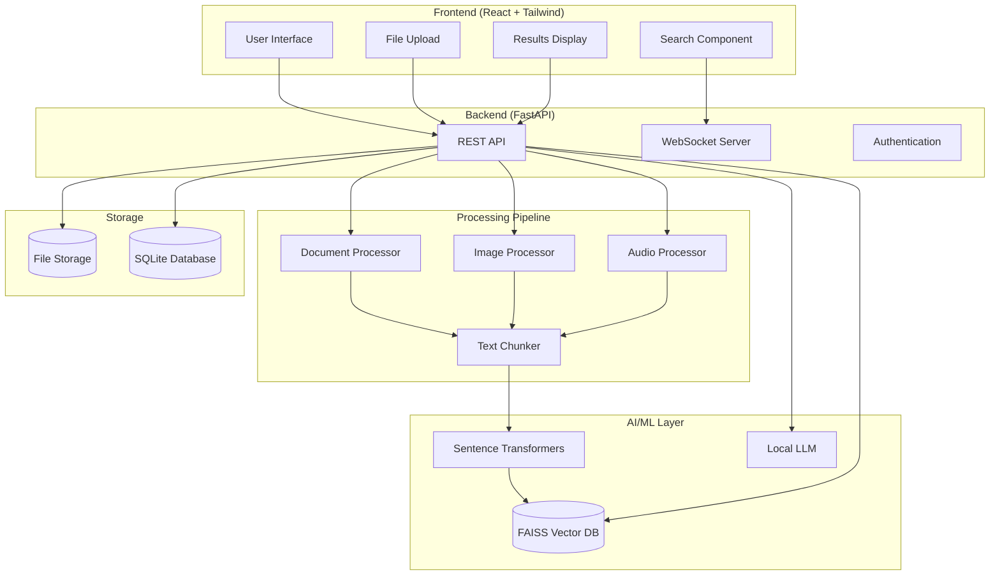

# 🌈 Prism - Multimodal RAG System

[](https://opensource.org/licenses/MIT)
[](https://www.python.org/downloads/)
[](https://reactjs.org/)
[](https://fastapi.tiangolo.com/)
[](https://github.com/)

> An intelligent offline-first multimodal Retrieval-Augmented Generation (RAG) system that enables unified search across documents, images, and audio files with natural language queries and transparent citation.

## 🚀 Features

### 🔍 **Intelligent Multimodal Search**
- **Unified Query Interface**: Search across PDF, DOCX, images, and audio with natural language
- **Cross-Modal Retrieval**: Find connections between text, images, and audio content
- **Voice Search**: Speak your queries naturally using built-in speech recognition
- **Semantic Understanding**: AI-powered search that understands context and meaning

### 📤 **Smart Content Processing**
- **Document Processing**: Extract text from PDF and DOCX files with structure preservation
- **OCR Technology**: Advanced text extraction from images and screenshots with bounding boxes
- **Speech Recognition**: Convert audio recordings to searchable text with timestamps
- **Real-time Processing**: Live progress updates during file upload and processing

### 🎯 **Transparent Results**
- **Citation System**: Every answer includes numbered citations linking to original sources
- **Source Navigation**: Click citations to view documents, play audio segments, or inspect images
- **Relevance Scoring**: Results ranked by semantic similarity and confidence
- **Context Previews**: Quick snippets before opening full content

### 🔒 **Privacy & Performance**
- **Offline Operation**: Complete privacy with no cloud dependencies
- **Local LLM**: Run language models entirely on your device
- **Fast Retrieval**: Optimized vector search with FAISS indexing
- **Secure Storage**: All data encrypted and stored locally

## 🎥 Demo


*Search across documents, images, and audio with natural language queries*

## 📋 Table of Contents

- [Quick Start](#quick-start)
- [Installation](#installation)
- [Architecture](#architecture)
- [Usage](#usage)
- [API Documentation](#api-documentation)
- [Configuration](#configuration)
- [Development](#development)
- [Deployment](#deployment)
- [Contributing](#contributing)
- [License](#license)

## ⚡ Quick Start

Get Prism running in under 5 minutes:

```bash
# 1. Clone the repository
git clone https://github.com/your-username/prism.git
cd prism

# 2. Start the frontend (Terminal 1)
cd frontend
npm install
npm run dev

# 3. Start the backend (Terminal 2)
cd backend
python -m venv venv
source venv/bin/activate  # Windows: venv\Scripts\activate
pip install -r requirements.txt
uvicorn src.api.main:app --reload

# 4. Open your browser
# Frontend: http://localhost:3000
# API Docs: http://localhost:8000/docs
```

## 🛠 Installation

### Prerequisites

**System Requirements:**
- **OS**: Linux, macOS, or Windows 10/11
- **Python**: 3.9 or higher
- **Node.js**: 16 or higher
- **RAM**: 8GB minimum (16GB recommended)
- **Storage**: 20GB free space

**System Dependencies:**
```bash
# Ubuntu/Debian
sudo apt-get update
sudo apt-get install tesseract-ocr ffmpeg build-essential python3-dev

# macOS
brew install tesseract ffmpeg

# Windows
# Download and install:
# - Tesseract: https://github.com/UB-Mannheim/tesseract/wiki
# - FFmpeg: https://ffmpeg.org/download.html
```

### Frontend Setup

```bash
cd frontend
npm install
npm run dev
```

The frontend will be available at `http://localhost:3000`

### Backend Setup

```bash
cd backend
python -m venv venv
source venv/bin/activate  # Windows: venv\Scripts\activate

# Install dependencies
pip install -r requirements.txt

# Initialize database
python -c "
from src.models.database import engine, Base
Base.metadata.create_all(bind=engine)
print('Database initialized successfully')
"

# Start the server
uvicorn src.api.main:app --reload --host 0.0.0.0 --port 8000
```

The backend will be available at `http://localhost:8000`

## 🏗 Architecture



### Technology Stack

**Frontend:**
- **React 18** - Modern UI library with hooks
- **Tailwind CSS** - Utility-first styling
- **Framer Motion** - Smooth animations
- **Vite** - Fast build tool
- **React Dropzone** - File upload handling

**Backend:**
- **FastAPI** - High-performance Python web framework
- **SQLAlchemy** - Database ORM
- **Pydantic** - Data validation
- **WebSockets** - Real-time communication

**AI/ML:**
- **Sentence Transformers** - Text embeddings
- **FAISS** - Vector similarity search
- **Whisper** - Speech recognition
- **Tesseract** - OCR text extraction
- **PyMuPDF** - PDF processing
- **Transformers** - Local LLM inference

## 📖 Usage

### 1. Upload Files

**Supported Formats:**
- **Documents**: PDF, DOCX
- **Images**: JPG, PNG, GIF, BMP, WebP
- **Audio**: MP3, WAV, M4A, AAC, OGG

```bash
# Via Web Interface
1. Click "Upload Files" in the sidebar
2. Drag and drop files or click to browse
3. Watch real-time processing progress

# Via API
curl -X POST "http://localhost:8000/upload" \
     -F "file=@document.pdf"
```

### 2. Search Content

**Natural Language Queries:**
```
"Show me the budget allocation for 2024"
"Find the screenshot taken at 2:30 PM"
"What did John say about the marketing strategy?"
"Search for documents mentioning customer feedback"
```

**Voice Search:**
1. Click the microphone icon
2. Speak your query naturally
3. Results appear with audio transcription

### 3. View Results

**Result Types:**
- **📄 Documents**: With page numbers and text highlighting
- **🖼️ Images**: With OCR text and bounding boxes  
- **🎵 Audio**: With timestamps and playable segments
- **🔗 Citations**: Numbered references to original sources

### 4. Citation Navigation

Click any citation number `[1]` to:
- **Documents**: Jump to specific page and paragraph
- **Images**: View full image with highlighted regions
- **Audio**: Play audio segment at exact timestamp

## 📚 API Documentation

### Authentication
```python
# Currently no authentication required (local-first)
# Future versions may include API keys for enterprise use
```

### Core Endpoints

#### Upload File
```http
POST /upload
Content-Type: multipart/form-data

{
  "file": <file_binary>
}

Response:
{
  "file_id": 123,
  "filename": "document.pdf",
  "status": "processing",
  "message": "File uploaded successfully"
}
```

#### Search
```http
POST /search
Content-Type: application/json

{
  "query": "What are the main findings?",
  "limit": 10,
  "filter_type": "document"  // optional: "document", "image", "audio"
}

Response:
{
  "results": [
    {
      "chunk_id": "uuid-string",
      "similarity": 0.95,
      "metadata": {
        "file_id": 123,
        "text": "The main findings indicate...",
        "source_info": {
          "type": "document",
          "page": 5
        }
      }
    }
  ],
  "response": "Based on the research, the main findings are... [1]",
  "citations": [
    {
      "citation_number": 1,
      "source_info": {
        "type": "document", 
        "page": 5
      },
      "text_preview": "The main findings indicate..."
    }
  ],
  "query_time": 1.23
}
```

#### List Files
```http
GET /files

Response:
{
  "files": [
    {
      "id": 123,
      "filename": "document.pdf",
      "upload_time": "2024-01-15T10:30:00Z",
      "processed": true,
      "file_size": 2048576
    }
  ],
  "total_count": 25
}
```

#### Health Check
```http
GET /health

Response:
{
  "status": "healthy",
  "version": "1.0.0",
  "uptime": 86400,
  "components": {
    "database": "healthy",
    "vector_store": "healthy", 
    "llm": "healthy"
  }
}
```

### WebSocket Events

```javascript
// Connect to real-time updates
const ws = new WebSocket('ws://localhost:8000/ws');

// Processing progress updates
ws.onmessage = (event) => {
  const data = JSON.parse(event.data);
  console.log(`File ${data.file_id}: ${data.progress.stage} - ${data.progress.percent}%`);
};

// Event types:
// - "upload_started"
// - "processing_started" 
// - "text_extracted"
// - "embeddings_created"
// - "processing_completed"
// - "processing_failed"
```

## ⚙️ Configuration

### Environment Variables

Create a `.env` file in the backend directory:

```bash
# Application Settings
APP_NAME=Prism RAG System
DEBUG=false
API_HOST=127.0.0.1
API_PORT=8000

# Database
DATABASE_URL=sqlite:///data/prism.db

# Processing
MAX_FILE_SIZE=104857600  # 100MB
CHUNK_SIZE=512
CHUNK_OVERLAP=50

# Models
EMBEDDING_MODEL=all-MiniLM-L6-v2
LLM_MODEL=microsoft/DialoGPT-medium
OCR_LANGUAGE=eng

# Vector Database  
VECTOR_DIM=384
FAISS_INDEX_TYPE=Flat

# CORS
CORS_ORIGINS=["http://localhost:3000"]
```

### Model Configuration

**Embedding Models (choose based on performance needs):**
```python
# Fast but less accurate
EMBEDDING_MODEL=all-MiniLM-L6-v2  # 384 dimensions

# Balanced performance
EMBEDDING_MODEL=all-mpnet-base-v2  # 768 dimensions

# Best accuracy (requires more RAM)
EMBEDDING_MODEL=all-roberta-large-v1  # 1024 dimensions
```

**LLM Models (choose based on hardware):**
```python
# Lightweight (4GB RAM)
LLM_MODEL=microsoft/DialoGPT-small

# Balanced (8GB RAM)  
LLM_MODEL=microsoft/DialoGPT-medium

# High quality (16GB+ RAM)
LLM_MODEL=microsoft/DialoGPT-large
```

### Advanced Configuration

**Vector Search Optimization:**
```python
# config/settings.py
class Settings(BaseSettings):
    # FAISS index types
    FAISS_INDEX_TYPE: str = "Flat"  # Exact search
    # FAISS_INDEX_TYPE: str = "IVF"   # Faster approximate search
    # FAISS_INDEX_TYPE: str = "HNSW"  # Best for large datasets
    
    # Search parameters
    SEARCH_NPROBE: int = 10  # IVF search quality
    SEARCH_EF: int = 200     # HNSW search quality
```

## 🔧 Development

### Project Structure

```
prism/
├── frontend/                 # React frontend
│   ├── src/
│   │   ├── components/      # React components
│   │   ├── hooks/           # Custom hooks
│   │   ├── utils/           # Utility functions
│   │   └── App.jsx          # Main app component
│   ├── public/              # Static assets
│   └── package.json
├── backend/                  # FastAPI backend
│   ├── src/
│   │   ├── api/            # API routes
│   │   ├── core/           # Business logic
│   │   ├── models/         # Database models
│   │   └── utils/          # Utilities
│   ├── config/             # Configuration
│   ├── data/               # Data storage
│   └── requirements.txt
├── docs/                    # Documentation
├── tests/                   # Test suites
├── docker-compose.yml       # Container orchestration
└── README.md               # This file
```

### Running Tests

**Backend Tests:**
```bash
cd backend
pytest tests/ -v

# With coverage
pytest tests/ --cov=src --cov-report=html

# Specific test categories
pytest tests/test_processors.py -k "test_pdf"
pytest tests/test_api.py -k "test_upload"
```

**Frontend Tests:**
```bash
cd frontend
npm test

# With coverage
npm test -- --coverage

# E2E tests (if configured)
npm run test:e2e
```

### Code Quality

**Backend:**
```bash
# Format code
black src/ tests/

# Lint code  
flake8 src/ tests/

# Type checking
mypy src/

# Pre-commit hooks
pre-commit install
pre-commit run --all-files
```

**Frontend:**
```bash
# Format code
npm run format

# Lint code
npm run lint

# Type checking (if using TypeScript)
npm run type-check
```

### Adding New Features

**1. New File Type Support:**
```python
# backend/src/core/processors/new_processor.py
class NewFileProcessor:
    def __init__(self):
        self.supported_formats = ['.new']
    
    def process_file(self, file_path: Path) -> Dict[str, Any]:
        # Implement processing logic
        return {
            "type": "new_type",
            "content": extracted_content,
            "metadata": metadata
        }

# Register in processing pipeline
# backend/src/core/processing_pipeline.py
elif file_path.suffix.lower() in ['.new']:
    await self._process_new_file(file_id, file_path)
```

**2. New Search Filters:**
```python
# Add to search endpoint
@router.post("/search")
async def search(
    query: str,
    file_type: Optional[str] = None,
    date_range: Optional[DateRange] = None,  # New filter
    language: Optional[str] = None           # New filter
):
    # Implement filtering logic
```

**3. New UI Components:**
```jsx
// frontend/src/components/NewComponent.jsx
import React from 'react'
import { motion } from 'framer-motion'

const NewComponent = ({ data }) => {
  return (
    <motion.div
      initial={{ opacity: 0 }}
      animate={{ opacity: 1 }}
      className="new-component"
    >
      {/* Component implementation */}
    </motion.div>
  )
}

export default NewComponent
```

## 🚀 Deployment

### Docker Deployment (Recommended)

**1. Build and Run:**
```bash
# Build images
docker-compose build

# Start services
docker-compose up -d

# View logs
docker-compose logs -f

# Stop services
docker-compose down
```

**2. Docker Compose Configuration:**
```yaml
# docker-compose.yml
version: '3.8'

services:
  prism-backend:
    build: ./backend
    ports:
      - "8000:8000"
    volumes:
      - ./data:/app/data
      - ./config:/app/config
    environment:
      - DEBUG=false
      - DATABASE_URL=sqlite:///data/prism.db
    restart: unless-stopped

  prism-frontend:
    build: ./frontend
    ports:
      - "3000:3000"
    environment:
      - REACT_APP_API_URL=http://localhost:8000
    restart: unless-stopped

  nginx:
    image: nginx:alpine
    ports:
      - "80:80"
    volumes:
      - ./nginx.conf:/etc/nginx/nginx.conf
    depends_on:
      - prism-frontend
      - prism-backend
```

### Manual Deployment

**Production Backend:**
```bash
cd backend

# Install production dependencies
pip install gunicorn

# Run with Gunicorn
gunicorn src.api.main:app \
  -w 4 \
  -k uvicorn.workers.UvicornWorker \
  --bind 0.0.0.0:8000 \
  --access-logfile - \
  --error-logfile -
```

**Production Frontend:**
```bash
cd frontend

# Build for production
npm run build

# Serve with nginx or static server
npx serve -s dist -l 3000
```

### Systemd Service (Linux)

**Backend Service:**
```ini
# /etc/systemd/system/prism-backend.service
[Unit]
Description=Prism RAG Backend
After=network.target

[Service]
Type=exec
User=prism
WorkingDirectory=/opt/prism/backend
Environment=PATH=/opt/prism/backend/venv/bin
ExecStart=/opt/prism/backend/venv/bin/gunicorn src.api.main:app -w 4 -k uvicorn.workers.UvicornWorker --bind 0.0.0.0:8000
Restart=always
RestartSec=5

[Install]
WantedBy=multi-user.target
```

**Enable and Start:**
```bash
sudo systemctl enable prism-backend
sudo systemctl start prism-backend
sudo systemctl status prism-backend
```

### Performance Tuning

**1. Database Optimization:**
```python
# Add indexes for better query performance
from sqlalchemy import Index

Index('idx_file_checksum', UploadedFile.checksum)
Index('idx_chunk_file_id', DocumentChunk.file_id)
Index('idx_embedding_id', DocumentChunk.embedding_id)
```

**2. Caching:**
```python
# Redis caching for embeddings
import redis
from functools import wraps

redis_client = redis.Redis(host='localhost', port=6379, db=0)

def cache_embeddings(func):
    @wraps(func)
    def wrapper(*args, **kwargs):
        cache_key = f"embeddings:{hash(str(args))}"
        cached = redis_client.get(cache_key)
        
        if cached:
            return pickle.loads(cached)
        
        result = func(*args, **kwargs)
        redis_client.setex(cache_key, 3600, pickle.dumps(result))
        return result
    
    return wrapper
```

**3. Load Balancing:**
```nginx
# nginx.conf
upstream prism_backend {
    server 127.0.0.1:8001;
    server 127.0.0.1:8002;
    server 127.0.0.1:8003;
    server 127.0.0.1:8004;
}

server {
    listen 80;
    
    location /api/ {
        proxy_pass http://prism_backend;
        proxy_set_header Host $host;
        proxy_set_header X-Real-IP $remote_addr;
    }
    
    location / {
        proxy_pass http://127.0.0.1:3000;
    }
}
```

## 🤝 Contributing

We welcome contributions! Please see our [Contributing Guide](CONTRIBUTING.md) for details.

### Development Workflow

1. **Fork the repository**
2. **Create a feature branch:**
   ```bash
   git checkout -b feature/amazing-feature
   ```
3. **Make your changes:**
   - Follow code style guidelines
   - Add tests for new features
   - Update documentation
4. **Commit your changes:**
   ```bash
   git commit -m 'Add some amazing feature'
   ```
5. **Push to the branch:**
   ```bash
   git push origin feature/amazing-feature
   ```
6. **Open a Pull Request**

### Code Style

**Python (Backend):**
- Follow PEP 8
- Use Black for formatting
- Add type hints
- Include docstrings

**JavaScript/React (Frontend):**
- Use Prettier for formatting
- Follow React best practices
- Use meaningful component names
- Add PropTypes or TypeScript

### Issue Reporting

**Bug Reports:**
- Use the bug report template
- Include system information
- Provide reproduction steps
- Add relevant logs

**Feature Requests:**
- Use the feature request template
- Explain the use case
- Describe expected behavior
- Consider implementation complexity

## 📄 License

This project is licensed under the MIT License - see the [LICENSE](LICENSE) file for details.

```
MIT License

Copyright (c) 2024 Prism Contributors

Permission is hereby granted, free of charge, to any person obtaining a copy
of this software and associated documentation files (the "Software"), to deal
in the Software without restriction, including without limitation the rights
to use, copy, modify, merge, publish, distribute, sublicense, and/or sell
copies of the Software, and to permit persons to whom the Software is
furnished to do so, subject to the following conditions:

The above copyright notice and this permission notice shall be included in all
copies or substantial portions of the Software.

THE SOFTWARE IS PROVIDED "AS IS", WITHOUT WARRANTY OF ANY KIND, EXPRESS OR
IMPLIED, INCLUDING BUT NOT LIMITED TO THE WARRANTIES OF MERCHANTABILITY,
FITNESS FOR A PARTICULAR PURPOSE AND NONINFRINGEMENT. IN NO EVENT SHALL THE
AUTHORS OR COPYRIGHT HOLDERS BE LIABLE FOR ANY CLAIM, DAMAGES OR OTHER
LIABILITY, WHETHER IN AN ACTION OF CONTRACT, TORT OR OTHERWISE, ARISING FROM,
OUT OF OR IN CONNECTION WITH THE SOFTWARE OR THE USE OR OTHER DEALINGS IN THE
SOFTWARE.
```

## 🙏 Acknowledgments

- **OpenAI** for Whisper speech recognition
- **Facebook Research** for FAISS vector search
- **Hugging Face** for Transformers and Sentence Transformers
- **Google** for Tesseract OCR
- **FastAPI** team for the excellent web framework
- **React** team for the UI library

## 📞 Support

- **Documentation**: [Full Documentation](docs/)
- **Issues**: [GitHub Issues](https://github.com/your-username/prism/issues)
- **Discussions**: [GitHub Discussions](https://github.com/your-username/prism/discussions)
- **Email**: support@prism-rag.com

---

<p align="center">
  <strong>Built with ❤️ for the future of intelligent information retrieval</strong>
</p>

<p align="center">
  <a href="#quick-start">Quick Start</a> •
  <a href="#installation">Installation</a> •
  <a href="#usage">Usage</a> •
  <a href="#api-documentation">API Docs</a> •
  <a href="#contributing">Contributing</a>
</p>